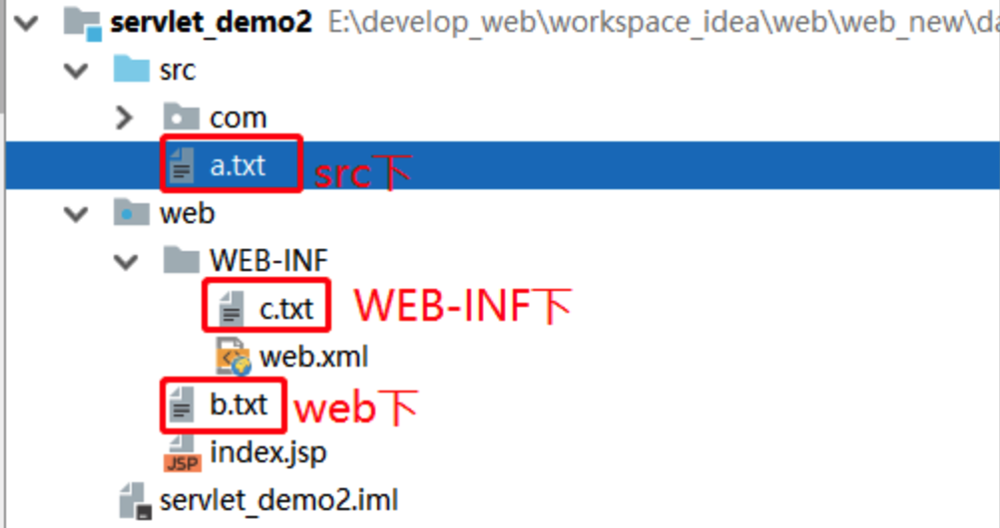

# 获得项目发布后的文件路径

- web项目发布后，是由tomcat服务器负责运行，所以开发环境的文件路径和发布后的文件路径是不一样的，而在运行过程中，是需要获取发布后的文件路径的

- getServletContext().getRealPath("war包下的目录")来获得项目发布后的真实路径



```java
ServletContext sc = getServletContext();
```

## 1. src/a.txt ->

day03_war_exploded2/WEB-INF/classes/a.txt


```java
String pathA = sc.getRealPath("/WEB-INF/classes/a.txt");
```


## 2. web/b.txt ->

day03_war_exploded2/b.txt


```java
String pathB = sc.getRealPath("/b.txt");
```


## 3. web/WEB-INF/c.txt -> 

day03_war_exploded2/WEB-INF/c.txt*


```java
String pathC = sc.getRealPath("/WEB-INF/c.txt");
```


